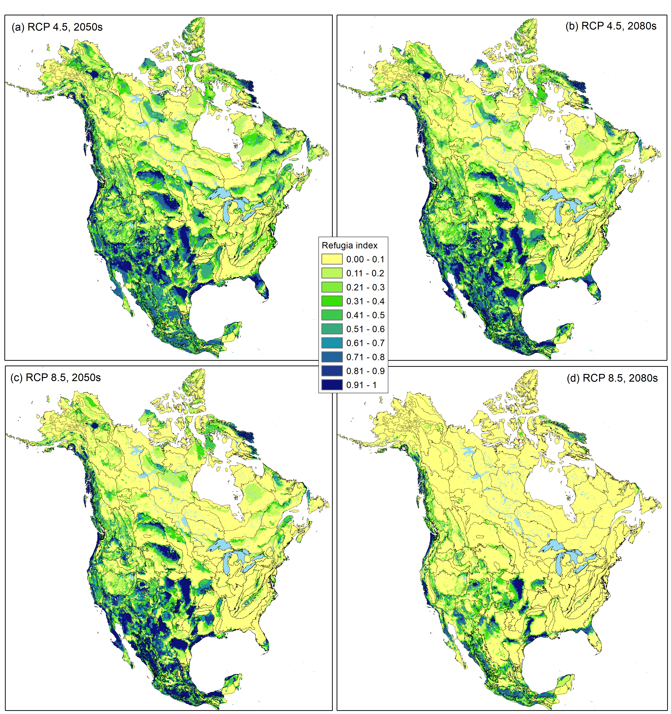

```{r setup, include=FALSE}
knitr::opts_chunk$set(echo = TRUE)
```
Suggested citation: Stralberg, Diana. 2019. Velocity-based macrorefugia for North American ecoregions [Data set]. Zenodo. http://doi.org/10.5281/zenodo.2579337

Climate-change refugia, or areas of species persistence under climate change, may vary in proximity to a species' current distribution, with major implications for their conservation value. Thus, the concept of climate velocity (Loarie et al. 2009)---the speed at which an organisms must migrate to keep pace with climate change---is useful to compare and evaluate refugia. Using analog climate methods, both forward and backward velocity can be calculated, providing complementary information about spatio-temporal responses to climate change (Hamann et al. 2014, Carroll et al. 2015). In particular, backward velocity calculations can be used to identify areas of high potential refugium value for a given time period and species or ecoregion (Stralberg et al. 2018a). Refugia for a given ecoregion represent areas where the climates of that ecoregion may persist into the future. 

I used random forest model projections of future ecoregions (Stralberg et al. 2018b) to generate an index of climate-change refugia potential for individual ecoregions, using the methods outlined in Stralberg et al. (2018a). The index ranges from 0 to 1, with values close to 1 indicating overlap or very close proximity to the current mapped ecoregion, across multiple climate models. Because the random forest algorithm is a classifier that assigns an ecoregion class to every future pixel, it does not account for novel climates that are not currently found in any North American ecoregion. Of course novelty is relative and can be measured in many different ways. I calculated a multivariate environmental similarity surface (MESS) following Elith et al. (2010) to generate an index of novelty for each future ecoregion (negative values indicate dissimilarity).

The code to produce these layers is outlined below. First, required packages and data files are loaded, and paths and projections are defined.

```{Install and load the required packages, define projection, paths, and input data}
library(raster)
library(dismo) #for mess function
library(yaImpute) # for ann function
library(dplyr) #for left_join function

LCC <- CRS("+proj=lcc +lat_1=49 +lat_2=77 +lat_0=0 +lon_0=-95 +x_0=0 +y_0=0 +ellps=GRS80 +units=m +no_defs")

#eco <- project directory
setwd(eco)
ecocurr <- raster("currentlcc.tif")
datlcc <- read.csv("CECEcoregionSampleLCC.csv")
ecolu <- read.csv("ecoregion_lookup.csv")
ecolev3 <- raster("ceclev3idlcc.asc")

#fut = directory containing grids representing derived future climate variables
#cur = directory containing grids representing derived current climate variables
```

A key component of the index is a distance-decay function based on a fat-tailed dispersal kernel, 
which accommodates rare long-distance dispersal events, and has been invoked to explain the rapid 
post-glacial recolonization of trees across northern North America (Clark et al. 1998). The following 
two functions are used to calculate (1) an individual probability value [ranging from 0 to 1] from a 
negative exponential distribution for a given distance (x), alpha, and shape (c); and (2) the mean 
dispersal distance for a given alpha and c. For a fat-tailed distribution, c = 0.5. 

```{negative exponential distribution}
fattail <- function(x, alpha, c) {
  left <- (c/(2*alpha*gamma(1/c)))
  right <- exp(-1*((abs(x/alpha))^c))
  result <- left*right
  return(right)
}

ftmean <- function(alpha, c) {
  result <-(alpha*gamma(2/c))/gamma(1/c)
  return(result)
}
```

To establish a threshold for future novelty, I calculated the range of climatic dissimilarity within each ecoregion based on baseline climates (1-km resolution). To reduce computation time, this was done using the same random sample of points (n=18,018) that was used to develop the random forest models (Stralberg et al. 2018b).

```{Separate out individual ecoregion predictions and calculate baseline novel climates}
setwd(cur)
clim <- list.files(cur, pattern =".asc$")
curclim<-stack(clim)

sampleclim<-cbind(datlcc,extract(curclim,as.matrix(cbind(datlcc[,3],datlcc[,4]))))
sc <- na.omit(sampleclim)
sc$NA_L3CODE <- as.factor(as.character(sc$NA_L3CODE))

pres <- ecocurr
pres[pres!=1] <- NA
pres <- raster::trim(pres)
writeRaster(pres,filename=paste(eco,1,"pred_curr",sep=""), format="GTiff", overwrite=TRUE)
ptc <- crop(curclim,pres)
ptc <-mask(ptc,pres)
p <- cbind(sc,extract(pres,as.matrix(cbind(sc[,3],sc[,4]))))
names(p)[ncol(p)] <- "pres"
p1 <- p[p$pres==1,]
if (nrow(p1)>0) {
  x <- try(m1 <- mess(ptc, p1[,5:30], full=FALSE))
  writeRaster(m1,filename=paste(eco,1,"novel_curr.tif",sep=""),overwrite=TRUE)
}
for (i in 2:181){
  pres <- ecocurr
  pres[pres==1] <- 0
  pres[pres==i] <- 1
  pres[pres!=1] <- NA
  pres <- raster::trim(pres)
  writeRaster(pres,filename=paste(eco,i,"pred_curr",sep=""), format="GTiff", overwrite=TRUE)	
  
  ptc <- crop(curclim,pres)
  ptc <-mask(ptc,pres)
  p <- cbind(sc,extract(pres,as.matrix(cbind(sc[,3],sc[,4]))))
  names(p)[ncol(p)] <- "pres"
  p1 <- p[p$pres==1,]
  if (nrow(p1)>0) {
    x <- try(m1 <- mess(ptc, p1[,5:30], full=FALSE))
    writeRaster(m1,filename=paste(eco,i,"novel_curr.tif",sep=""),overwrite=TRUE)
  }
}
```
I then calculated the refugia index at the ecoregion level, averaging across projections for 10 global climate models. Dispersal parameters were the same as in Stralberg et al. (2018a). This was repeated for two future time periods (2050s and 2080s) as well as two representative concentration pathways (RCP 4.5 and RCP 8.5). The code presented here is for RCP 8.5 (2080s).

```{Calculate refugia index}
setwd(eco)
eco2080 <- list.files(eco, pattern="2085.tif$")
eco2080 <- grep(pattern="rcp85",eco2080,value=TRUE) 
emptystack<-stack(raster(eco2080[1]))
emptystack<-dropLayer(emptystack,1)
for (i in 1:181){
	velstack <-emptystack
	pres <- ecocurr
	pres[pres==1] <- 0
	pres[pres==i] <- 1
	pres[pres!=1] <- 0	
	present<-as.data.frame(rasterToPoints(pres))
	names(present)[3] <- "current"
	for (j in 1:length(eco2080)) {
		fut <- raster(eco2080[j])
		fut[fut==1] <- 0
		fut[fut==i] <- 1
		fut[fut!=1] <- 0
		future<-as.data.frame(rasterToPoints(fut))
		names(future)[3] <- "EcoLev3_2080"
		p.xy<-cbind(seq(1,length(present$x),1),present$x,present$y,present$current)
		f.xy<-cbind(seq(1,length(future$x),1),future$x,future$y,future$EcoLev3_2080)
		p.xy2<-p.xy[p.xy[,4]==1,1:3,drop=FALSE]
		f.xy2<-f.xy[f.xy[,4]==1,1:3,drop=FALSE]
		if(nrow(f.xy2)>0){
			d.ann <- as.data.frame(ann(as.matrix(p.xy2[,-1,drop=FALSE]),as.matrix(f.xy2[,-1,drop=FALSE]),k=1, verbose=F)$knnIndexDist)
			d1b <- as.data.frame(cbind(f.xy2, round(sqrt(d.ann[,2]))))
			names(d1b) <- c("ID","X","Y","bvel")
			f.xy <- as.data.frame(f.xy)
			names(f.xy) <- c("ID","X","Y","Pres")
			d1b<-left_join(f.xy,d1b,by=c("ID","X","Y"))
			d1b$fat <- fattail(d1b$bvel, 8333.3335, 0.5) # alpha value that results in mean of 50 km / century or 500 m/year
			sppref<-rasterFromXYZ(d1b[,c(2,3,6)])
			sppref <- extend(sppref,ecocurr)
			sppref[is.na(sppref[])] <- 0
			} else {
			print(i)
			sppref <- ecocurr*0}
		velstack <- addLayer(velstack,sppref)
	}
	velmean <- calc(velstack,fun=mean,na.rm=TRUE)
	projection(velmean) <- LCC
	writeRaster(velmean,filename=paste(i,"refmean2080_rcp85",sep=""), format="GTiff", overwrite=TRUE)
}
```
Because the refugia index goes rapidly to zero outside of a given ecoregion, there is very little overlap among refugia values for individual ecoregions. To display refugia potential across ecoregions, I took the maximum value at any given pixel. I.e., a given pixel was assigned a value based on the ecoregion for which it had the highest refugia potential (Figure 1). In the majority of cases this was the ecoregion in which the pixel is currently found. However, in many instances, a border pixel had a greater chance of serving as a refugium for a nearby ecoregion type than retaining the climate conditions of its current ecoregion.

```{Calculate combined ecoregion refugia }
ref <- list.files(eco, pattern="2080_rcp85.tif$")	
refs <- stack(ref)
rmax <- refs[[1]]
for (i in 2:length(ref)) {
  s <- stack(rmax,refs[[i]])
  rmax <- calc(s,max)
}
rmax <- mask(rmax,ecocurr)
writeRaster(rmax,filename="_rcp85_2080_maxref1", format="GTiff", overwrite=TRUE)
```




Finally, I used the sample points to perform a MESS analysis for each ecoregion, time period (2050s, 2080s) and representative concentration pathway (RCP 4.5, RCP 8.5).

```{Calculate climate dissimilarity for each future ecoregion projection}
w  <- paste(future,"NA_ENSEMBLE_rcp85_2080s_Bioclim_ASCII/",sep="")
setwd(w)
futclim <- list.files(w,pattern=".asc$")
s <-stack(futclim)
m <- c(-1000, 0.999, 0,  0.999, 1.001, 1, 1.001, 1000,0)
rclmat <- matrix(m, ncol=3, byrow=TRUE)
pres <- ecocurr
pres[pres!=1] <- 0	
p <- cbind(sc,extract(pres,as.matrix(cbind(sc[,3],sc[,4]))))
names(p)[ncol(p)] <- "pres"
p1 <- p[p$pres==1,]
if (nrow(p1)>0) {
  fut <- raster(paste(eco,"_pred_rcp85_2080s.tif",sep=""))
  fut[fut!=1] <- NA	
  x<- try(cellStats(fut,min))
  if (x!=Inf) {
    ft <- raster::trim(fut)
    f <- crop(s,ft)
    f1<-mask(f,ft)
    x <- try(m1 <- mess(f1, p1[,5:30], full=FALSE))
    writeRaster(m1,filename=paste(eco,1,"novel_rcp85_2080s.tif",sep=""),overwrite=TRUE)
  }
}
for (i in 2:181) {
  pres <- ecocurr
  pres[pres==1] <- 0
  pres[pres==i] <- 1
  pres[pres!=1] <- 0	
  p <- cbind(sc,extract(pres,as.matrix(cbind(sc[,3],sc[,4]))))
  names(p)[ncol(p)] <- "pres"
  p1 <- p[p$pres==1,]
  if (nrow(p1)>0) {
    fut <- raster(paste(eco,"_pred_rcp85_2080s.tif",sep=""))
    fut[fut==1] <- 0
    fut[fut==i] <- 1
    fut[fut!=1] <- NA	
    x<- try(cellStats(fut,min))
    if (x!=Inf) {
      ft <- raster::trim(fut)
      f <- crop(s,ft)
      f1<-mask(f,ft)
      x <- try(m1 <- mess(f1, p1[,5:30], full=FALSE))
      writeRaster(m1,filename=paste(eco,i,"novel_rcp85_2080s.tif",sep=""),overwrite=TRUE)
    }
  }
}
```
For mapping purposes, novel climates for each ecoregion, RCP, and time period were identified as those with values lower than the 1st percentile of dissimiarity values for the baseline periods:

[1. RCP 8.5, 2080s](https://drive.google.com/file/d/1mxJupbS2hQ7MNPNEycWRMYO98sBbsBsh/view?usp=sharing)

[2. RCP 8.5, 2050s](https://drive.google.com/file/d/10v2MGRyCVTrOoSMBOoBJ79XtVUDXnVoP/view?usp=sharing)

[3. RCP 4.5, 2080s](https://drive.google.com/file/d/14gfhuYI5M_NdaTcYg_rAaHm6L6GiEkVJ/view?usp=sharing)

[4. RCP 4.5, 2050s](https://drive.google.com/file/d/1xhMfck9COX0hBozB9sis1GfJwJrxGq_y/view?usp=sharing)


**References**

Carroll, C., J. J. Lawler, D. R. Roberts, and A. Hamann. 2015. Biotic and climatic velocity identify contrasting areas of vulnerability to climate change. PLoS ONE 10:e0140486.

Clark, J. S., C. Fastie, G. Hurtt, S. T. Jackson, C. Johnson, G. A. King, M. Lewis, J. Lynch, S. Pacala, C. Prentice, E. W. Schupp, I. I. I. T. Webb, and P. Wyckoff. 1998. Reid's Paradox of Rapid Plant MigrationDispersal theory and interpretation of paleoecological records. BioScience 48:13-24.

Elith, J., M. Kearney, and S. Phillips. 2010. The art of modelling range-shifting species. Methods in Ecology and Evolution 1:330-342.

Hamann, A., D. Roberts, Q. Barber, C. Carroll, and S. Nielsen. 2015. Velocity of climate change algorithms for guiding conservation and management. Global Change Biology 21:997-1004.

Stralberg, D., C. Carroll, J. H. Pedlar, C. B. Wilsey, D. W. McKenney, and S. E. Nielsen. 2018a. Macrorefugia for North American trees and songbirds: Climatic limiting factors and multi-scale topographic influences. Global Ecology and Biogeography 27:690-703. https://doi.org/10.1111/geb.12731 

Stralberg, Diana. 2018b. Climate-projected distributional shifts for North American ecoregions [Data set]. Zenodo. http://doi.org/10.5281/zenodo.1407176
